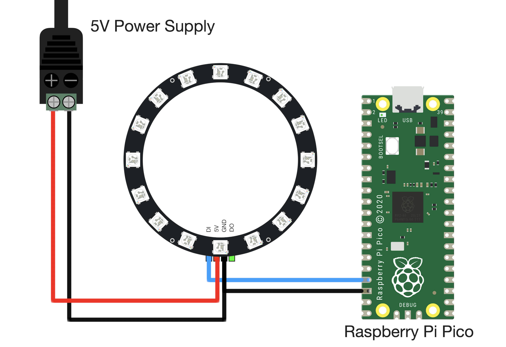

# Raspberry Pi Pico WS2812B Ring Light Control
Raspberry Pi Pico RGB LED (WS2812) Controle de luz anelar com MicroPython

### JUMP TO:
<a href="#start">- Diagrama de Ligação</a><br>
<a href="#state">- MicroPython State Machine</a><br>
<a href="#examples">- WS2812 Algorithm Examples </a><br>
<a href='#google'>- Google Home and Amazon Alexa LED Emulator </a><br>

A biblioteca RPi Pico WS2812 pode ser baixada usando git:

    git clone https://github.com/caneto/raspberry-pico-ws2812/

<a id="start"></a>
# - Wiring Diagram -
O diagrama de ligação entre o Raspberry Pi Pico e um anel de luz LED RGB de 16 pixels é mostrado abaixo:



A ligação da pinagem também é fornecida na tabela abaixo:

| Fonte de energia | Pico | Anel de Luz |
| --- | --- | --- |
| + | N/A | 5V |
| N/A | GPIO13 | DI | 
| - | GND | GND |

A maioria dos pinos GPIO pode ser usada para controlar a matriz de LED WS2812, portanto, a especificação do GPIO13 para controlar a luz é arbitrária. Certifique-se de alterar o pino nos códigos também, se estiver usando outro pino para a ligação.

<a id="state"></a>
# - MicroPython State Machine -
A matriz de anel de luz LED RGB de 16 pixels será controlada usando o esquema descrito no [Raspberry Pi Pico MicroPython getting started document](https://datasheets.raspberrypi.org/pico/raspberry-pi-pico-python-sdk.pdf), where we can get started with the tutorial entitled “Using PIO to drive a set of NeoPixel Ring (WS2812 LEDs).” The tutorial contains a script that will be used to create a state machine on the RPi Pico. The state machine will be used to control the LEDs on the ring light using a single pin on the Pico (GPIO13 in the wiring above). The full MicroPython example script can also be found at the Raspberry Pi Pico’s [NeoPixel Ring repository](https://github.com/raspberrypi/pico-micropython-examples/blob/master/pio/neopixel_ring/neopixel_ring.py).

O código para iniciar a máquina de estado no pino #13 GPIO do Pico é fornecido abaixo:

```python
import array, time
from machine import Pin
import rp2
#
############################################
# RP2040 PIO e configurações de pinos
############################################
#
# Configuração do anel LED WS2812
led_count = 16 # número de LEDs no anel de luz
PIN_NUM = 13 # pino conectado ao anel de luz
brightness = 0.5 # 0.1 = darker, 1.0 = brightest

@rp2.asm_pio(sideset_init=rp2.PIO.OUT_LOW, out_shiftdir=rp2.PIO.SHIFT_LEFT,
             autopull=True, pull_thresh=24) # PIO configuration

# define os parâmetros WS2812
def ws2812():
    T1 = 2
    T2 = 5
    T3 = 3
    wrap_target()
    label("bitloop")
    out(x, 1)               .side(0)    [T3 - 1]
    jmp(not_x, "do_zero")   .side(1)    [T1 - 1]
    jmp("bitloop")          .side(1)    [T2 - 1]
    label("do_zero")
    nop()                   .side(0)    [T2 - 1]
    wrap()

# Crie o StateMachine com o programa ws2812, produzindo no pino pré-definido
# na frequência de 8 MHz
state_mach = rp2.StateMachine(0, ws2812, freq=8_000_000, sideset_base=Pin(PIN_NUM))

# Ative a máquina de estado
state_mach.active(1)
```
O trecho de código fornecido acima será usado para cada algoritmo usado para testar o anel de luz LED WS2812 de 16 pixels.

<a id="examples"></a>
# - WS2812 Algorithm Examples -
Example output for:
-[/tests/ws2812_simple.py](/tests/ws2812_simple.py)


Exemplo de saída para:
- [/tests/ws2812_breathing.py](/tests/ws2812_breathing.py)


<a id="google"></a>
# - Google Home and Amazon Alexa LED Emulator -
No exemplo de script final, as rotinas para emular a rotina de rotação quadricolor do Google Home são fornecidas, junto com o LED rotativo e a rotina zipada usada pelos dispositivos Amazon Alexa.
 
Exemplo de saída para:
- [/tests/google_amazon_emulator.py](/tests/google_amazon_emulator.py)


# 
Encontre uma demonstração de vídeo em: https://youtu.be/_ikSpqb8x1k
# 
1